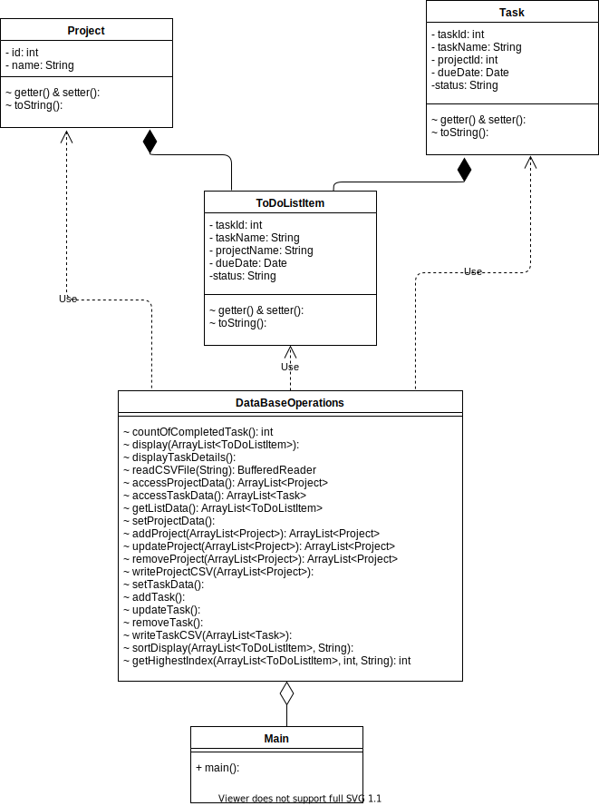

### Class diagram for To-Do list application

This application contains 5 classes.

* The main class name is Main. 

* The functions related to To-Do list application are in DataBaseOperation class.

* The Project class handles the project data.
 
*  The Task class handles the task data.

* The class ToDoListItem used to display the task details pertaining to concerned project. 

---

---